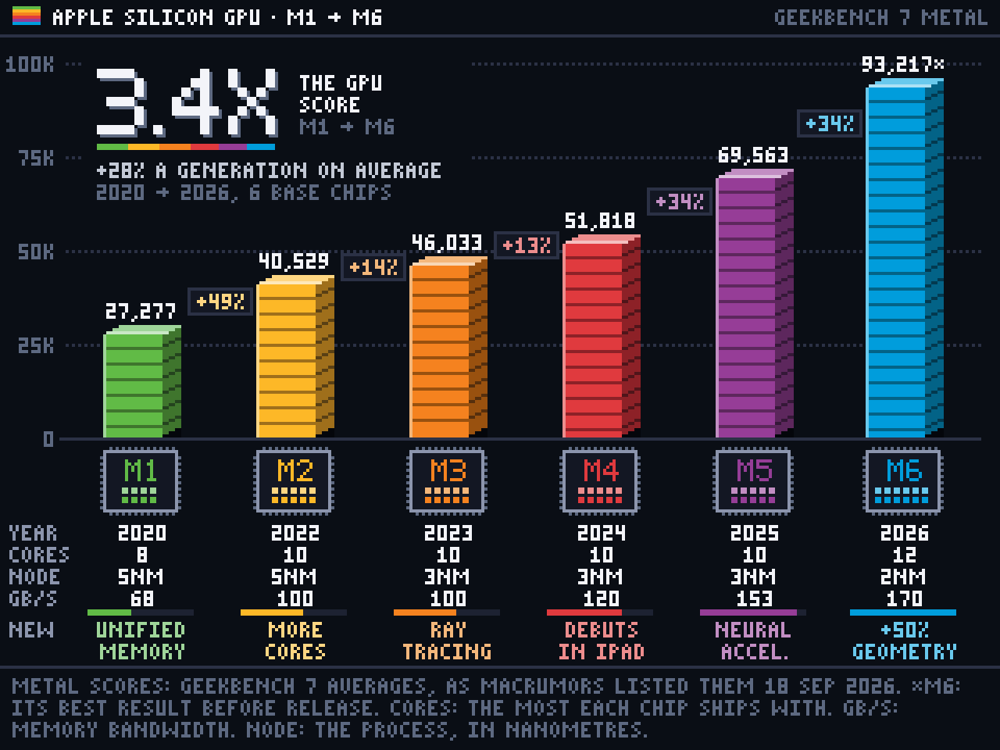
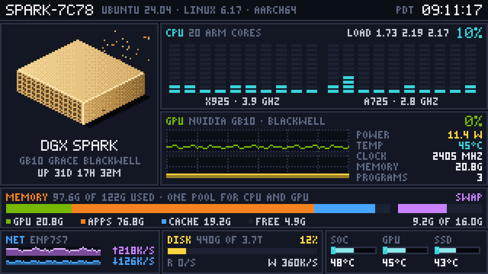
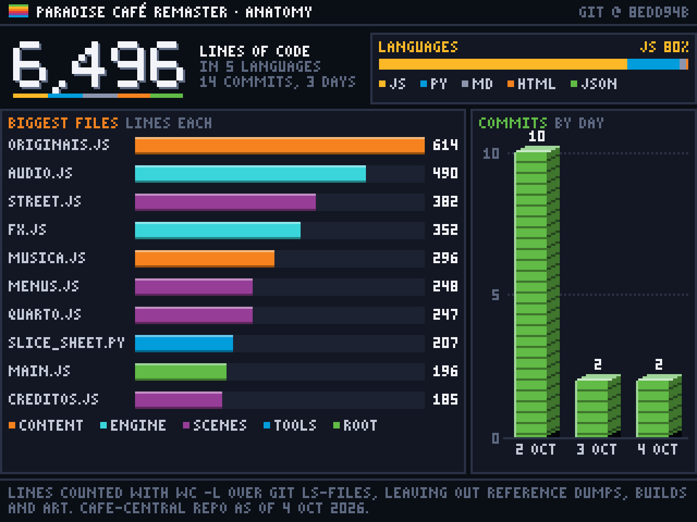
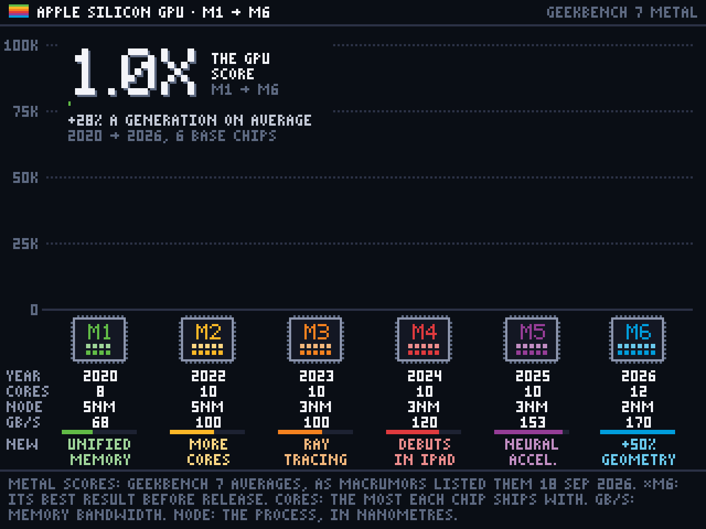
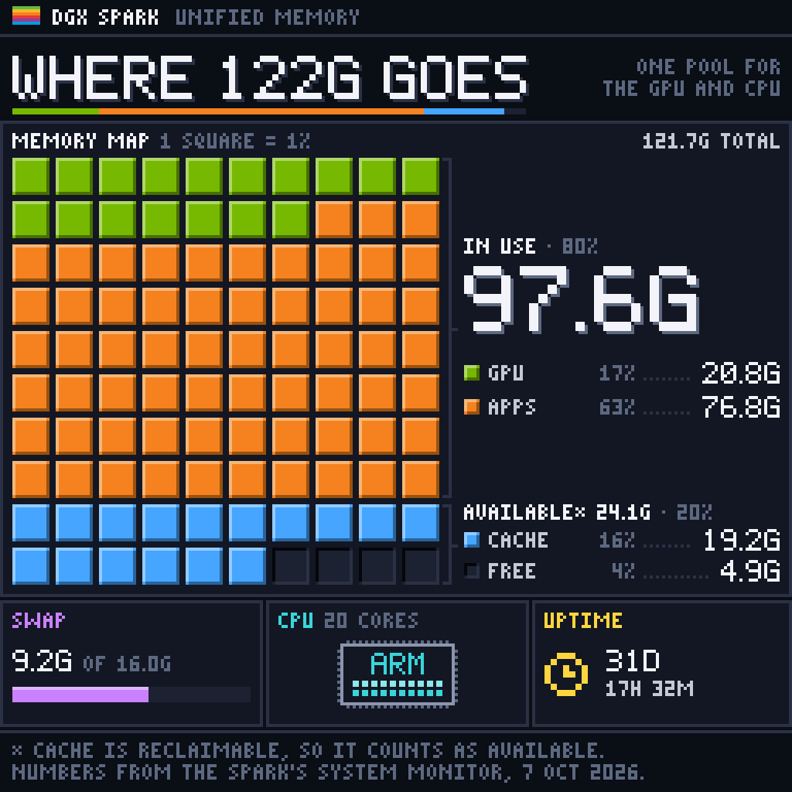
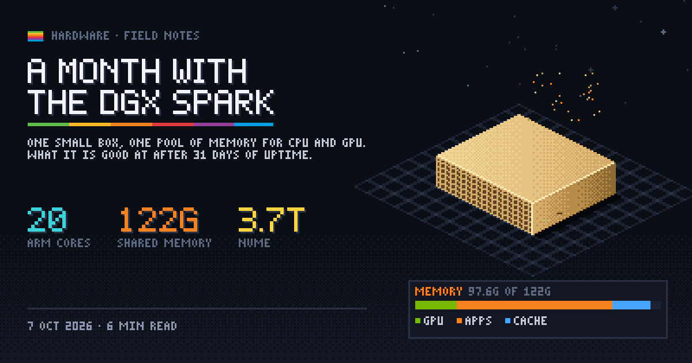
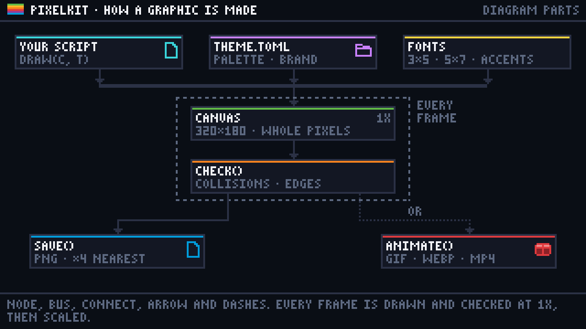
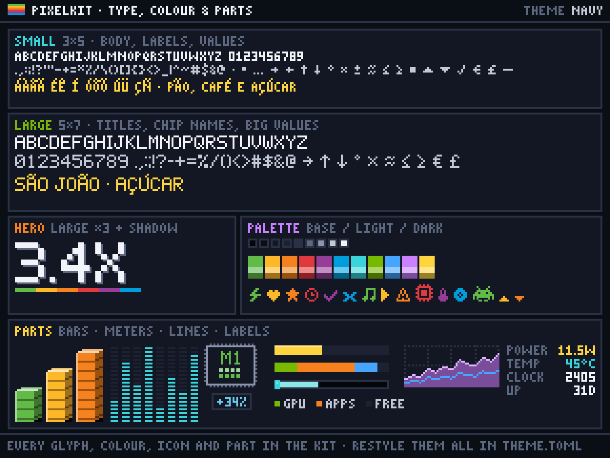
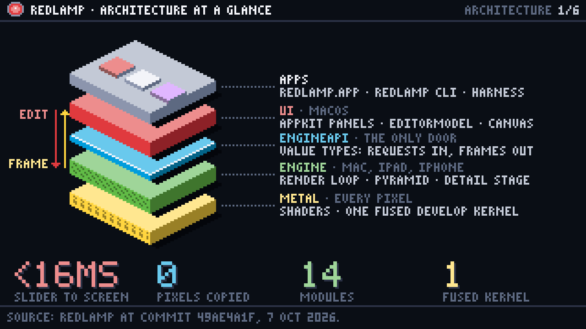

# pixelartvisuals

Pixel-art infographics, charts, diagrams and animations for blog posts, drawn on a tiny grid and
exported crisp.



Every graphic is drawn on a small logical canvas (320×180 by default) in whole pixels, then
scaled up with nearest-neighbour filtering, so each pixel becomes a sharp 4×4 block. Two bitmap
fonts, a navy-and-rainbow palette and a set of parts (striped 3D bars, LED meters, gauges,
sparklines, waffles, isometric devices) give everything the same retro look. The same drawing code
exports stills (PNG) and animations (GIF, WebP, MP4).

The repo holds two things:

- [`skill/`](skill/): the kit, `pixelkit` (Python), with its templates, its theme and the
  instructions an AI agent follows to make new graphics (a Cursor or Claude Code skill).
- [`projects/`](projects/): series made with it, starting with
  [Redlamp's architecture](projects/redlamp-architecture/).

## Gallery

| | |
| --- | --- |
|  |  |
| `dashboard.py`: the state of a machine | `dashboard_live.py`: the same, live, as a seamless loop |
|  |  |
| `ranking.py`: a hero total, a share bar and a top 10 | `generations_intro.py`: bars rise, values count up |
|  |  |
| `waffle.py`: parts of a whole | `cover.py`: a post cover and social card |
|  |  |
| `diagram.py`: nodes, a bus and connectors | `specimen.py`: every glyph, colour, icon and part |
## Projects

[**Redlamp's architecture, in six pictures**](projects/redlamp-architecture/): an open-source raw
photo editor's layers, modules, pipeline, frame timing, storage and on-device models, drawn with
the kit's diagram parts.

[](projects/redlamp-architecture/)

## Quick start

Requires Python 3.11 or later with Pillow and numpy. ffmpeg is needed only for MP4.

```python
from pixelkit import Canvas

c = Canvas(preset="wide")                          # 320x180, exported at 4x: 1280x720
bottom = c.footer("SOURCE: WHERE THE NUMBERS CAME FROM, 7 OCT 2026")
top = c.header("COFFEE · CUPS PER DAY", right="ONE WEEK")
p = c.panel(0, top + 1, 320, bottom - top - 3, "THIS WEEK", color="orange")
c.bar_chart(p.x, p.y + 8, p.w, p.h - 20, [3, 2, 4, 5, 6, 1, 0],
            xlabels=["MON", "TUE", "WED", "THU", "FRI", "SAT", "SUN"], ticks=3, ymax=6)
c.save("coffee.png")                               # prints any layout warnings
```

```bash
PYTHONPATH=skill/scripts python3 coffee.py
```

Wrap the drawing in `draw(c, t)` and call `animate(draw, "coffee.gif", seconds=2, hold=3)` to
animate it. [`skill/SKILL.md`](skill/SKILL.md) has the workflow and style rules, and
[`skill/reference.md`](skill/reference.md) the whole API. After changing the kit, run
`python3 skill/scripts/selftest.py`.

## Use it as an agent skill

The `skill/` folder is a skill for Cursor and Claude Code: it teaches the agent the style, the
templates and the review steps. Link it into place:

```bash
ln -s "$PWD/skill" ~/.cursor/skills/pixel-graphics    # Cursor
ln -s "$PWD/skill" ~/.claude/skills/pixel-graphics    # Claude Code
```

Then ask for a pixel graphic for a post. The skill's quick start expects it at
`~/.cursor/skills/pixel-graphics`. A link into a repo on an external disk disappears while that
disk is unplugged.

## Theme

[`skill/theme.toml`](skill/theme.toml) sets the palette (nine neutrals and eleven accents, each
with light and dark shades), the order series colours are used in, number separators, and the brand
name and mark printed in headers and footers. Change it to restyle every future graphic, or pass
`Canvas(theme="other.toml")`.

## Credits

The 5×7 title font comes from the author's Paradise Café remaster. The look follows two system
dashboards and charts drawn in this style, rebuilt with the kit as `dashboard.py` and
`generations.py`.

## Licence

[MIT](LICENSE).
