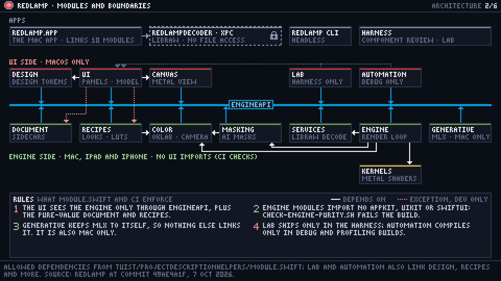
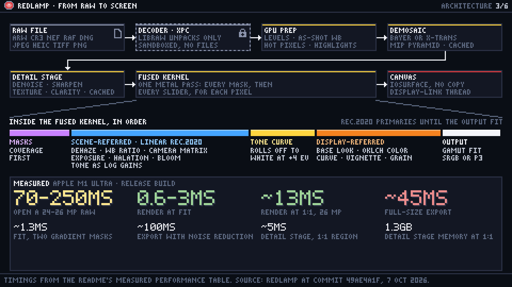
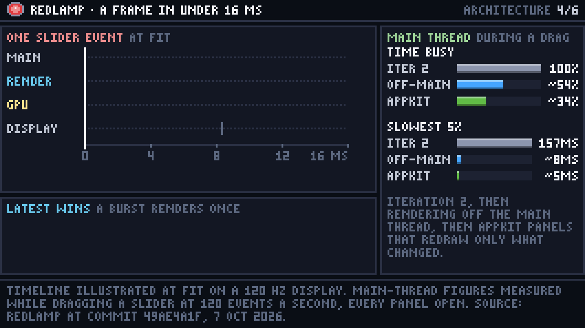
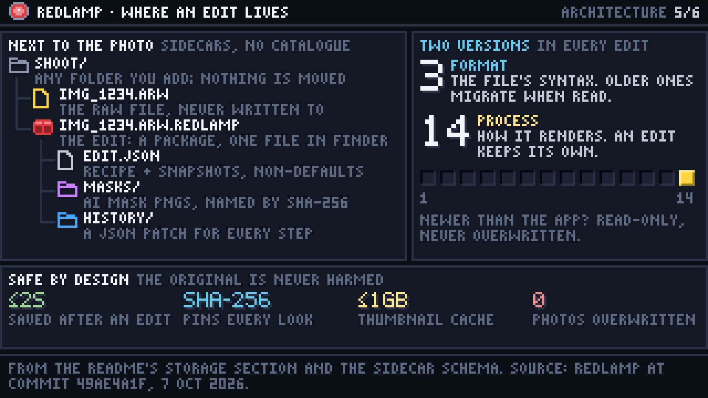
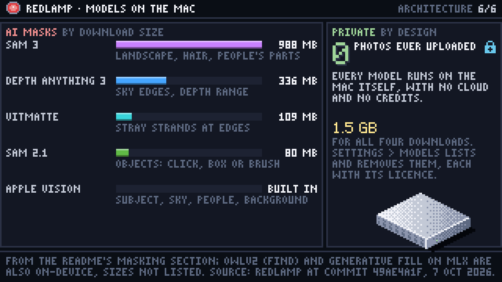

# Redlamp's architecture, in six pictures

[Redlamp](https://github.com/pdcgomes/redlamp) is an open-source raw photo editor for the Mac,
built in Swift and Metal. This series explains how it is put together, from the layers down to
where an edit is saved. Every fact comes from Redlamp's README, its sidecar schema and its Tuist
manifests at commit `49ae4a1f` (7 October 2026), and each image names its source in the footer.

[One tall poster with all six](poster.png) is there for sharing.

## 1. At a glance


Redlamp stacks into five layers: the apps, a UI that is macOS-only for now, a small API of plain
values, an engine that builds for the Mac, iPad and iPhone, and Metal shaders that touch every
pixel. An edit goes down through the API as a request and comes back up as a frame, and the
frame's pixels are never copied on the way.

## 2. Modules and boundaries



Fourteen modules, and `Tuist/ProjectDescriptionHelpers/Module.swift` decides which may depend on
which. Twelve of them link `RedlampEngineAPI`, drawn as the rail between the two sides. The UI may
also link the pure-value Document and Recipes, nothing on the engine side may import AppKit, UIKit
or SwiftUI, and CI checks both. The app decodes photos in a sandboxed XPC process that receives a
file's bytes, never the file.

## 3. From raw to screen



LibRaw only unpacks the sensor data, inside that sandbox; everything after it runs on the GPU. The
demosaiced image is kept as a mip pyramid, the detail stage caches what it computes, and one fused
kernel then applies every mask and every slider in a single pass. That pass works on
scene-referred linear light up to the tone curve and on display-referred values after it. Frames
reach the canvas as IOSurfaces.

## 4. A frame in under 16 ms



A slider event costs the main thread a fraction of a millisecond, crosses the API as a request,
renders in 0.6 to 3 ms at Fit and is on screen by the next refresh. When requests arrive faster
than frames, each new one replaces the one waiting, so a burst renders once. Moving rendering off
the main thread, and then the panels to AppKit, took the main thread from fully busy during a drag
to about a third busy.

## 5. Where an edit lives



Redlamp is an editor, not a catalogue. Each edit lives beside its photo in a small package: the
edit's JSON, AI mask bitmaps named by their SHA-256, and a history kept as JSON Patch. Every edit
carries a format version (its syntax) and a process version (how it renders), so an edit made last
year keeps rendering as it did. A sidecar written by a newer Redlamp opens read-only and is never
overwritten.

## 6. Models on the Mac



The AI masks run on models on the Mac itself: Apple Vision's built-in ones and four downloads,
from 80 MB to 988 MB and about 1.5 GB in all, which Settings › Models lists and removes. Photos
are never uploaded.

## How it was made

Each image is a short Python script drawn with the kit in [`skill/`](../../skill/), on a 320×180 or
480×270 grid, and exported at 4×. `series.py` holds what the six share: the header with Redlamp's
safelight mark, the footer that cites the source, and one colour per layer (red for the UI, blue
for the API, green for the engine, gold for the GPU). Image 4 is drawn as a function of time and
exported as a GIF with a still poster.

```bash
cd projects/redlamp-architecture
export PYTHONPATH=../../skill/scripts
for f in 0*.py; do python3 "$f"; done
python3 poster.py
```

The series was a test of whether the kit scales from charts to architecture. It needed one new
set of parts, diagram nodes, elbow connectors and a bus, which now ship with the kit. The rest
came from the existing parts and the layout checks, which flagged every label that ran past a
panel edge while the images were being drawn.
